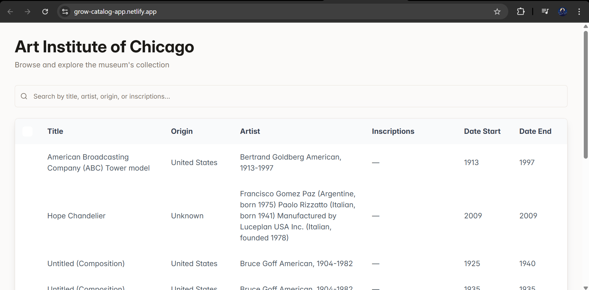

# 🏛️ Museum Catalog Page

A **React + Vite** application that displays a catalog of museums in a clean, responsive **table view**.  
Built with **TypeScript, Tailwind CSS, and shadcn-ui**, this project provides a simple yet modern UI for browsing museums.

---

## 📸 Preview

  

---

## 🚀 Features

- ✅ Modern UI with **React + Vite**  
- ✅ Styled using **Tailwind CSS** & **shadcn-ui components**  
- ✅ Displays **museum list in a structured table**  
- ✅ Fully **responsive** for desktop & mobile  
- ✅ Easy setup and deployment  

---

## 🛠️ Tech Stack

- **React (with Vite)** → Lightning-fast dev server & build system  
- **TypeScript** → Safer, scalable code  
- **Tailwind CSS** → Utility-first styling  
- **shadcn-ui** → Ready-to-use, elegant UI components  

---

## ⚙️ Setup Walkthrough

Follow these steps to run the project locally:

### 1️⃣ Clone the Repository
```sh
git clone <YOUR_REPO_URL>
cd <YOUR_PROJECT_NAME>

npm install

npm run dev
